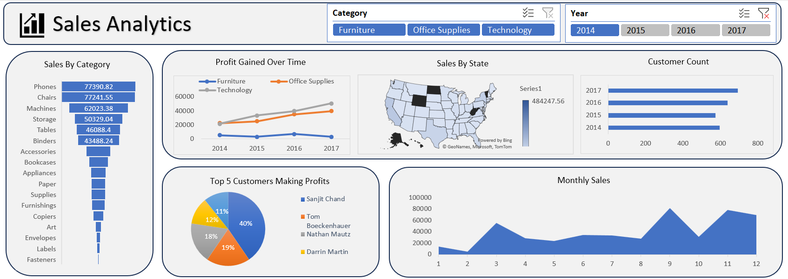

<h2 align="center">Sales Analytics with Excel</h2>

In my dynamic journey of data analytics, I took the reins to dive into the world of sales analytics using the versatile Excel. This project was a testament to leveraging powerful tools at hand to derive actionable insights from complex datasets.

1. Sales by Category

2. Profit Gained Over Time

3. Sales by State

4. Customer Count

5. Top 5 Customers Making Profits and Monthly Sales
